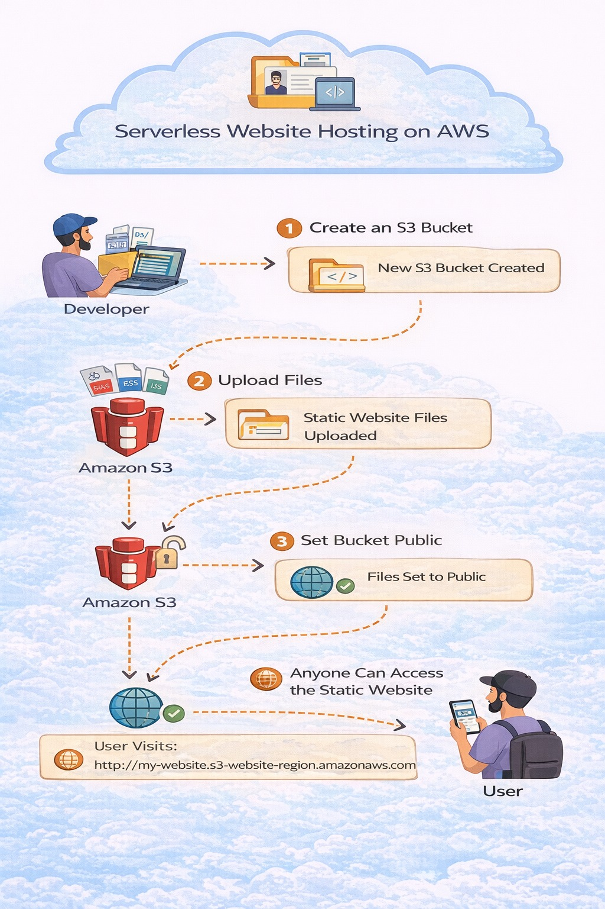
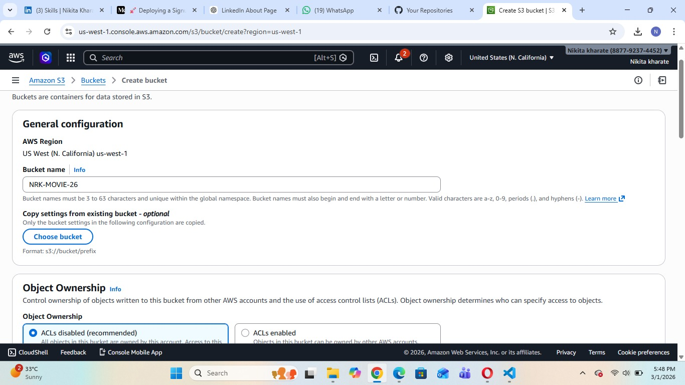
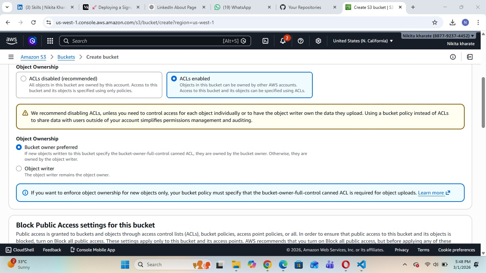
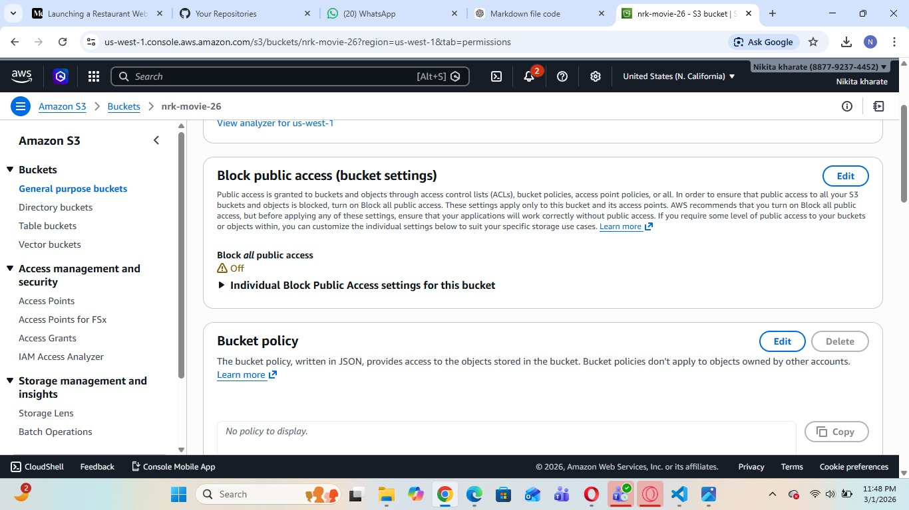
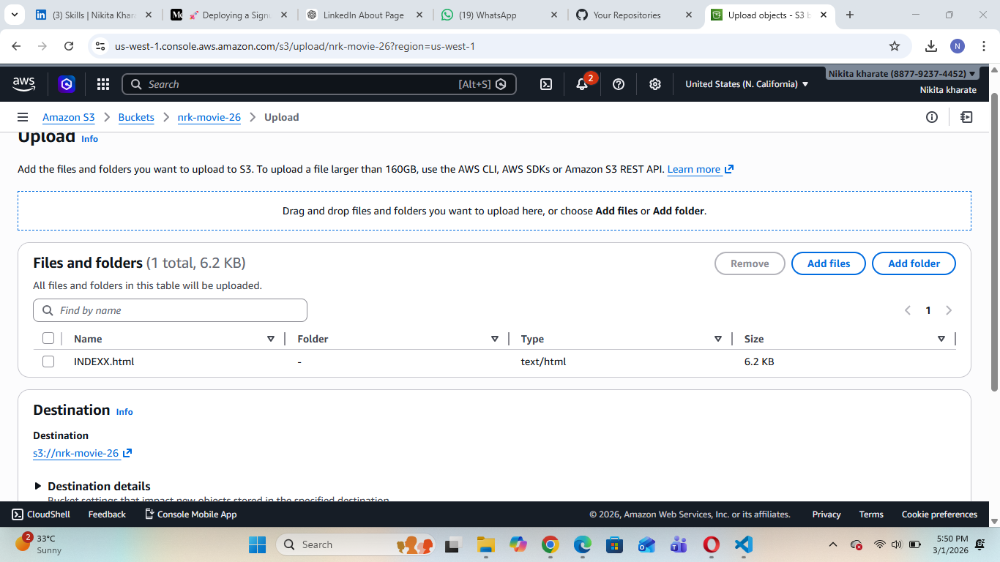
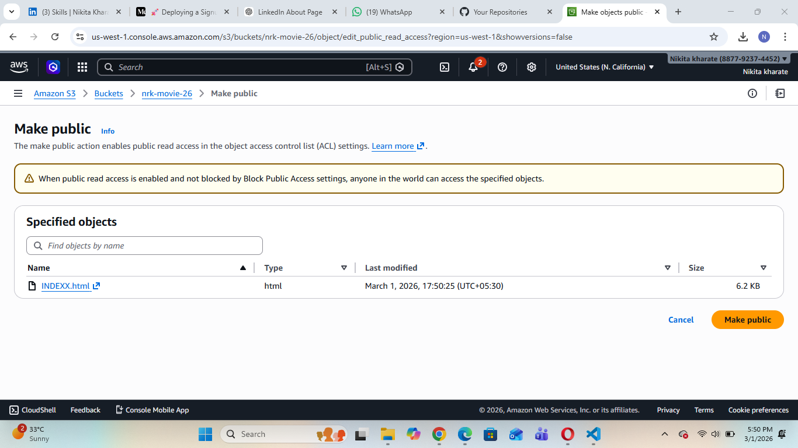
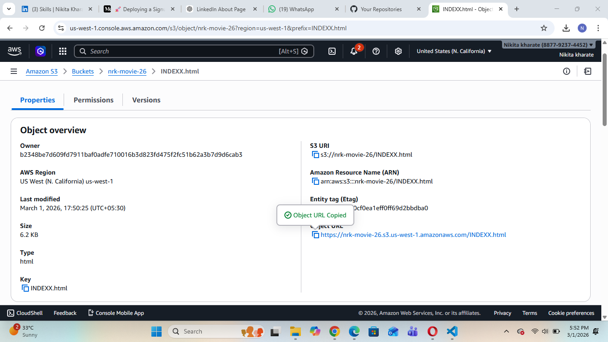
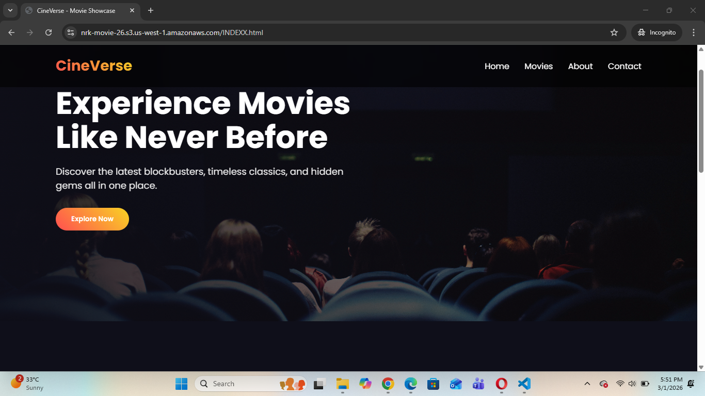

# Serverless Website Hosting

## Introduction
This project demonstrates how to host a **static website using a fully serverless approach**. The website is deployed using an Amazon S3 bucket without provisioning or managing any servers.

Serverless website hosting is a cost-effective and scalable solution for hosting static websites such as portfolios, landing pages, and documentation sites.

---

## Project Objective
- Host a static website without using EC2 or traditional servers
- Configure public access for static content
- Understand S3 bucket permissions and ACL settings
- Deploy and access a live website through a browser

---

## Architecture Overview

Client (Browser)
        ↓
S3 Bucket (Static Website Files)
        ↓
Public Access Configuration
        ↓
Website Endpoint URL

This architecture eliminates the need for:
- Web servers
- Operating system management
- Scaling configuration

---

## Technologies Used
- Amazon S3
- Static HTML/CSS/JS
- Access Control Lists (ACL)

---

## Step-by-Step Implementation

### Step 1: Create an S3 Bucket
- Logged into AWS Console
- Navigated to S3 service
- Clicked on "Create bucket"
- Provided a unique bucket name
- Selected appropriate region

---

### Step 2: Enable ACLs
- During bucket creation, selected ACL enabled option
- Allowed management of object-level permissions

---

### Step 3: Remove Block Public Access
- Disabled "Block all public access"
- Confirmed acknowledgment warning

This step allows the website content to be accessible over the internet.

---

### Step 4: Create Bucket Successfully
- Reviewed configuration
- Created the bucket

---

### Step 5: Upload Static Website Files
- Uploaded static website files (HTML, CSS, JS)
- Example: index.html

---

### Step 6: Make Files Public
- Selected uploaded files
- Modified object permissions
- Enabled public read access

This allows users to access the content directly from the browser.

---

### Step 7: Access Website via Browser
- Copied the S3 object URL or website endpoint
- Opened the URL in a web browser
- Successfully displayed the website

---

## Key Features
- Fully serverless deployment
- No server management required
- Low-cost hosting solution
- Highly scalable infrastructure
- Suitable for portfolio and static sites

---

## Advantages of Serverless Website Hosting
- Reduced operational overhead
- Pay only for storage used
- High durability and availability
- Easy deployment and maintenance

---

## Limitations
- Supports only static websites
- No backend processing without additional services
- Requires proper permission management

---

## Conclusion
This project successfully demonstrates serverless website hosting using Amazon S3. By eliminating the need for traditional servers, the solution provides a scalable, cost-effective, and simple hosting environment for static web applications.

The project reflects practical cloud deployment knowledge and a strong understanding of serverless architecture principles.

---

**Project Implemented Using Serverless Cloud Architecture** 

